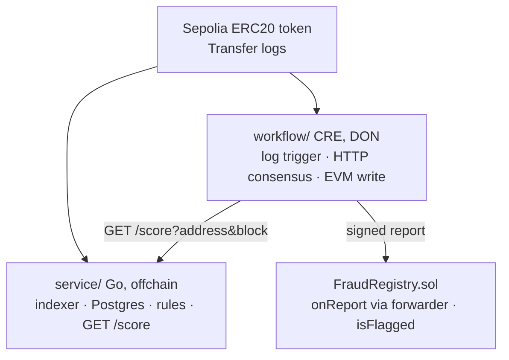
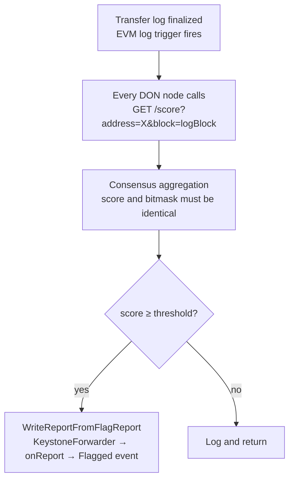
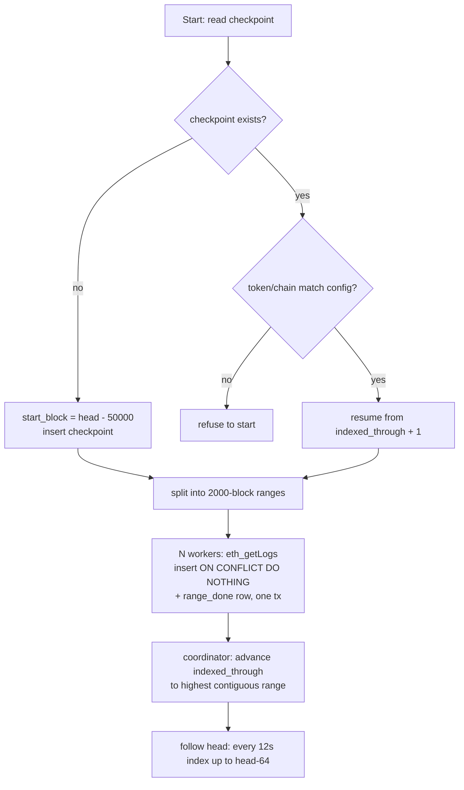
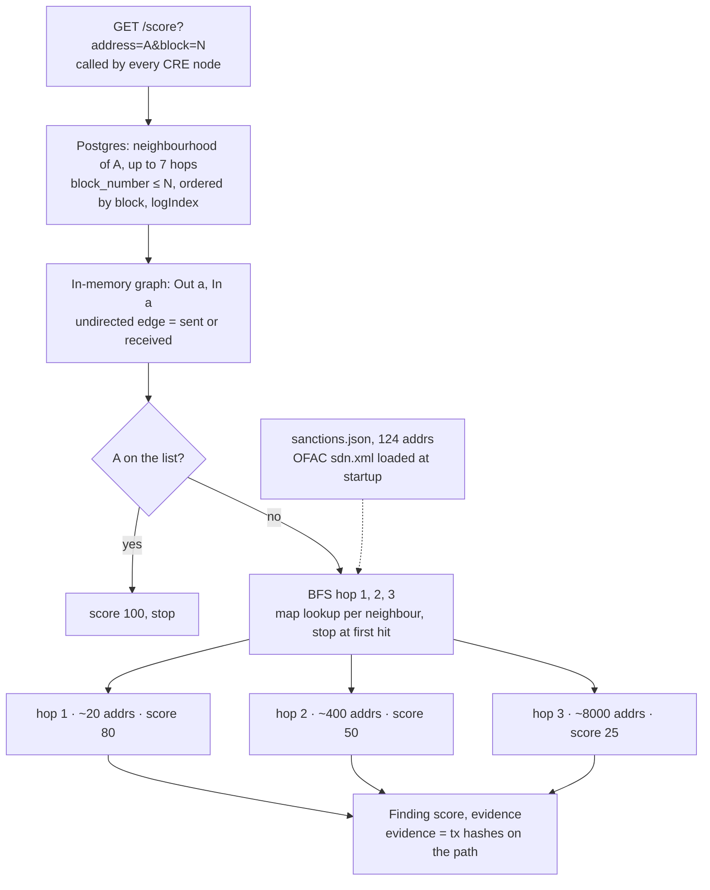
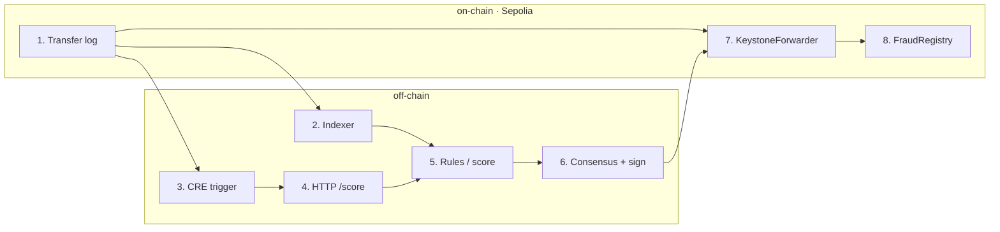

# Flow charts

## System overview

## Per-transfer flow

## Indexer flow

## Sanctions proximity: 3-hop BFS

Why the list lives in the service and not behind an external API: one `/score` call can touch thousands of addresses across three hops. A per-address screening API at 30–100 requests/hour cannot serve that, and its answers could differ between CRE nodes. A static list pinned at commit time is both fast and deterministic.

## On-chain vs off-chain, step by step

| # | Where | Step | Who runs it |
|---|---|---|---|
| 1 | on-chain | ERC20 `Transfer(from,to,value)` log emitted, block finalized | Sepolia |
| 2 | off-chain | Indexer stores the log in Postgres, advances checkpoint | `service/cmd/indexer` |
| 3 | off-chain | CRE log trigger fires the workflow on every DON node | CRE DON |
| 4 | off-chain | Each node calls `GET /score?address=X&block=N` independently | CRE HTTP capability |
| 5 | off-chain | Rules run: peel chain + sanctions BFS, score 0-100 | `service/cmd/api` |
| 6 | off-chain | Consensus: identical score/bitmask required; DON signs a report | CRE consensus |
| 7 | on-chain | `KeystoneForwarder` verifies signatures, calls `onReport` | Chainlink forwarder |
| 8 | on-chain | `FraudRegistry` decodes `FlagReport`, emits `Flagged`, `isFlagged(addr)` = true | our contract |

Only steps 1, 7, 8 cost gas. Steps 2-6 are free compute; step 6 is the only one that turns a single server's opinion into a verifiable fact.

