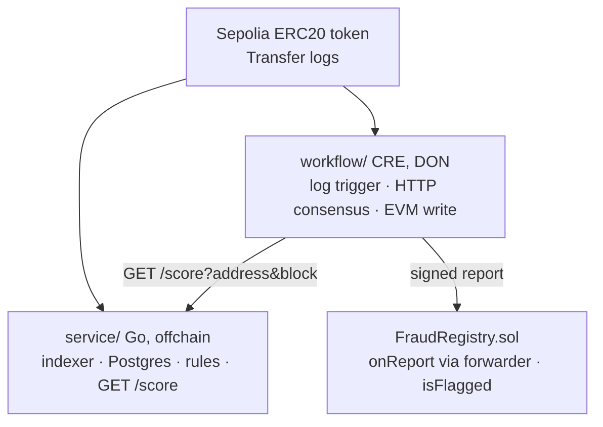
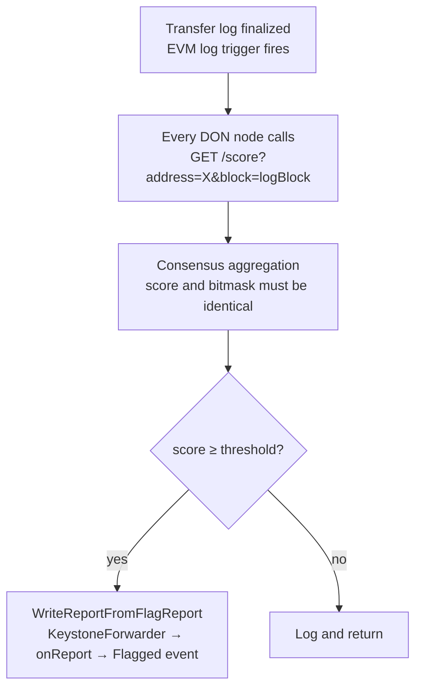
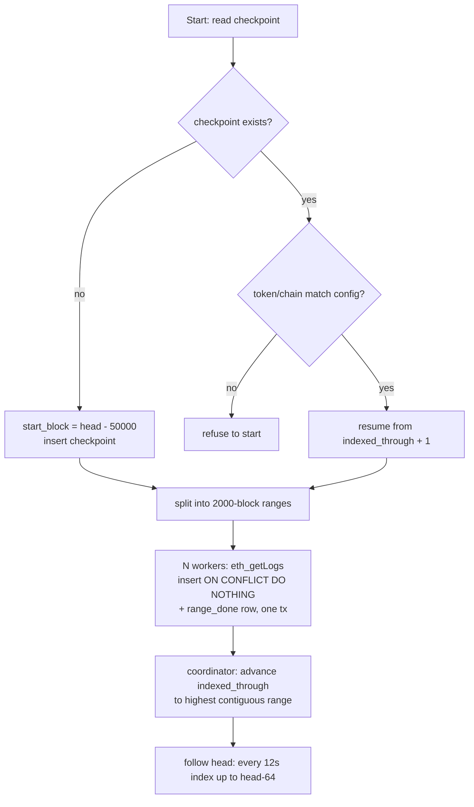

# Flow charts

## System overview

```mermaid
flowchart TB
    T[Sepolia ERC20 token<br/>Transfer logs]
    S[service/ Go, offchain<br/>indexer · Postgres · rules · GET /score]
    W[workflow/ CRE, DON<br/>log trigger · HTTP consensus · EVM write]
    R[FraudRegistry.sol<br/>onReport via forwarder · isFlagged]
    T --> S
    T --> W
    W -- GET /score?address&block --> S
    W -- signed report --> R
```

## Per-transfer flow

```mermaid
flowchart TB
    A[Transfer log finalized<br/>EVM log trigger fires]
    B[Every DON node calls<br/>GET /score?address=X&block=logBlock]
    C[Consensus aggregation<br/>score and bitmask must be identical]
    D{score ≥ threshold?}
    E[WriteReportFromFlagReport<br/>KeystoneForwarder → onReport → Flagged event]
    F[Log and return]
    A --> B --> C --> D
    D -- yes --> E
    D -- no --> F
```

## Indexer flow

```mermaid
flowchart TB
    S0[Start: read checkpoint] --> S1{checkpoint exists?}
    S1 -- no --> S2[start_block = head - 50000<br/>insert checkpoint]
    S1 -- yes --> S3{token/chain match config?}
    S3 -- no --> X[refuse to start]
    S3 -- yes --> S4[resume from indexed_through + 1]
    S2 --> S5
    S4 --> S5[split into 2000-block ranges]
    S5 --> S6[N workers: eth_getLogs<br/>insert ON CONFLICT DO NOTHING<br/>+ range_done row, one tx]
    S6 --> S7[coordinator: advance indexed_through<br/>to highest contiguous range]
    S7 --> S8[follow head: every 12s index up to head-64]
```
