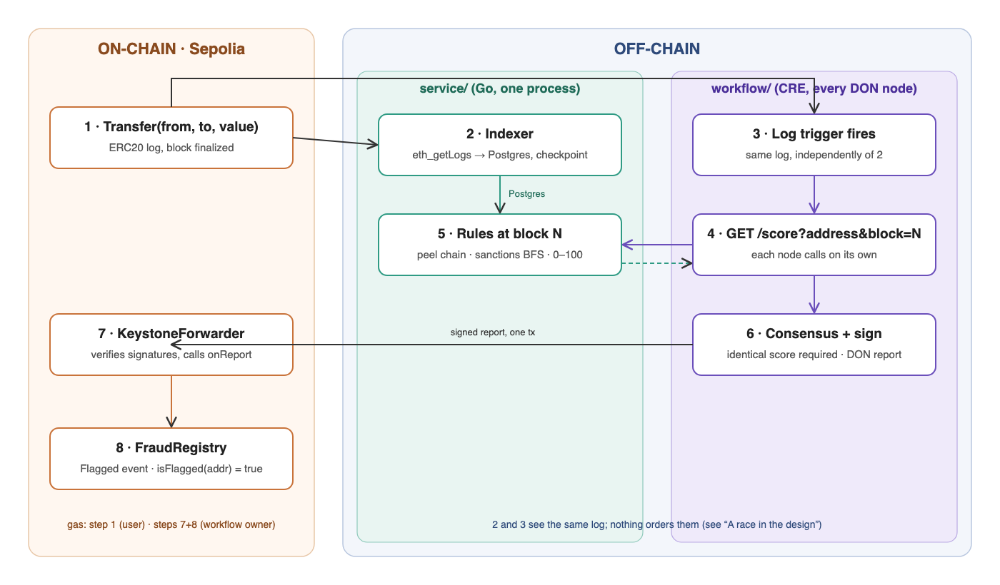

# Building an On-chain Fraud Oracle with Go and Chainlink CRE

*A weekend project: fraud detection in Go, published on-chain through a decentralized oracle network. Code: github.com/<user>/fraud-oracle.*

## Why on-chain

A fraud score is an opinion. Chainalysis has one, TRM has one, my Go service has one. Each sits behind an HTTP endpoint, each is one company's word, each can change between two calls. Fine for a dashboard. Not fine for a smart contract.

A contract cannot call an API, retry, or ask a second opinion. Whatever it reads from storage, it acts on. If one server wrote that storage, the protocol has outsourced its security to that server.

The industry has paid for this lesson. In 2019 a bad price source pushed Synthetix's oracle to report the Korean won at 1000x, and a bot minted about a billion dollars of synthetic assets before the trades were reversed. One off-chain fact entered a contract with nobody checking it on the way in.

The stakes are not small. Chainalysis's 2026 Crypto Crime Report counts $154 billion of illicit crypto volume in 2025, $104 billion of it reaching sanctioned entities, a 694% jump in one year, and stablecoins carrying 84% of the illicit flow. When the Bybit hack took $1.5 billion in February 2025, blockchain analytics firms attributed it to Lazarus within 48 hours and exchanges were freezing the proceeds within days. The data exists and the tracing works; what is missing is a way for a contract to act on it.

The value of an on-chain flag is not the storage. It is that the **write can be made verifiable**: several independent parties fetch the same answer, agree, sign, and the contract accepts only their joint signature.

This is also where the big money is going. In 2025 Chainlink, Swift and UBS piloted tokenized fund subscriptions triggered by ISO 20022 Swift messages flowing through the Chainlink Runtime Environment (CRE). In September 2026 Chainlink announced that banks can connect their existing systems and key infrastructure to Swift's blockchain ledger through CRE for 24/7 tokenized-deposit payments. The pattern is identical to this project: a trusted off-chain system, an oracle network that verifies the handoff, a contract that acts on it. A fraud flag is a small instance of the same bridge.

So: analysis off-chain, because walking fifty thousand blocks of transfers has no business inside a contract. Publication through CRE, because a decentralized oracle network, a **DON**, a fixed set of Chainlink nodes run by separate companies that fetch the same data and sign only what they agree on, turns my single API into something a contract can trust more than me.

## What it does

One ERC20 token on Sepolia, Ethereum's test network. For every `Transfer`, score the sender and the receiver 0 to 100. At or above a threshold, record it in `FraudRegistry`, which any contract can query with `isFlagged(address)`.



Only steps 1, 7 and 8 pay gas. Step 6 is where one server's opinion becomes a verifiable fact.

## The Go service

**Indexer.** An Ethereum node answers "which logs did this contract emit in these blocks", not "who did this address pay". So the indexer pulls `Transfer` logs with `eth_getLogs` in 2,000-block ranges, eight in flight, into Postgres keyed on `(tx_hash, log_index)`. Each range commits with a `range_done` marker; a checkpoint advances only over contiguous ranges. Kill it, restart it, it resumes without re-fetching. Two habits from running my own Ethereum and BSC nodes: index only up to `head - 64` so reorgs never reach the table, and split a range in half when the provider says "too many results", because every provider has a different limit.

**Rules.** Each rule is one Go type behind one interface, run against an in-memory graph of the address's two-hop neighbourhood, sorted by `(block, log_index)` so the same data always gives the same answer.

- *Peel chain.* A → B → C → D, each receiver fresh, each forwarding at least 90% within 1,000 blocks. Three hops score 30, each extra hop +20, cap 100. Greedy along the largest transfer; misses a chain that splits.
- *Sanctions proximity.* Breadth-first search, undirected, three hops, against the 124 EVM addresses on the OFAC SDN list. On the list: 100. One hop: 80. Two: 50. Three: 25.

The list is real. `cmd/ofac` pulls `sdn.xml` from treasury.gov and keeps every `0x` address under any `Digital Currency Address` tag. OFAC tags per asset, not per chain: 120 say `ETH`, four say `USDT`, `USDC`, `ARB`, `BSC` or `ETC`. My first version filtered on `ETH` and silently lost four; a reviewer caught it. Why a file and not Chainalysis's free API? One score call touches thousands of addresses across three hops, and a per-address API cannot serve that. A list pinned at commit time is fast and identical on every node.

Undirected proximity has a known abuse: send dust from a listed address and the victim is one hop away. That happened at scale after the Tornado Cash designation. A production rule weights inbound taint lower; this one does not, and flags have no expiry. Both are under "Not built".

**API.** `GET /score?address=0x…&block=N` returns

```json
{"address":"0x…","score":80,"ruleBitmask":2,
 "rules":[{"name":"sanctions_proximity","evidence":["0x…"]}],
 "indexedThroughBlock":9123456}
```

`block` is the piece that makes the design work. DON nodes do not call at the same instant, and the indexer is not at the same height every time. Without `block`, two nodes could get two answers, consensus would fail, nothing would ever be written. With it, every node scores the same graph. `indexedThroughBlock` reports the height actually used and is excluded from consensus. Handler timeout is four seconds; CRE's HTTP capability gives up at five.

**The race.** The indexer and the CRE trigger read the same log independently. The trigger fires at finality; the indexer writes at `head - 64`. Nothing orders them. If the workflow asks for block N before the indexer has it, the service clamps to what it has. Consensus survives, but the triggering transfer is not in the graph yet, so the flag lands one transfer late. Deterministic, never wrong, but late. The fix is a bounded wait on the checkpoint; not built this weekend.

## The contract

I planned `FraudRegistry.flag(address, score, bitmask)`. A CRE workflow does not call your contract. DON nodes sign a report, the EVM write capability delivers it to a Chainlink `KeystoneForwarder`, and the forwarder calls `onReport(bytes metadata, bytes report)` after checking enough registered signers are on it. Your contract inherits `ReceiverTemplate`, implements `_processReport(bytes)`, decodes the payload.

`FraudRegistry` is forty lines on top of that:

```solidity
contract FraudRegistry is ReceiverTemplate {
  struct FlagReport { address subject; uint8 score; uint32 ruleBitmask; }
  struct Flag       { uint8 score; uint32 ruleBitmask; uint64 flaggedAt; }

  mapping(address => Flag) private s_flags;
  event Flagged(address indexed subject, uint8 score, uint32 ruleBitmask);

  constructor(address forwarder) ReceiverTemplate(forwarder) {}

  // Exists so `cre generate-bindings` emits WriteReportFromFlagReport. Never callable.
  function flag(FlagReport calldata) external pure { revert DirectFlagNotAllowed(); }

  function isFlagged(address a) external view returns (bool) { return s_flags[a].flaggedAt != 0; }

  // Called by ReceiverTemplate.onReport after the forwarder check.
  function _processReport(bytes calldata report) internal override {
    FlagReport memory r = abi.decode(report, (FlagReport));
    if (r.score > 100) revert InvalidScore(r.score);
    s_flags[r.subject] = Flag(r.score, r.ruleBitmask, uint64(block.timestamp));
    emit Flagged(r.subject, r.score, r.ruleBitmask);
  }
}
```

The forwarder check lives in `ReceiverTemplate.onReport`: `if (msg.sender != s_forwarderAddress) revert InvalidSender(...)`. Foundry tests cover that path, the always-revert on `flag`, and a score above 100. One trap: `cre workflow simulate` writes through a `MockKeystoneForwarder` that passes no metadata, so deploy with the mock address for the demo and switch to the real forwarder for production.

## The CRE workflow

Eighty lines of Go, compiled to WebAssembly, run by every node in the DON. Bindings come from `cre generate-bindings evm`; the handler receives a decoded `From`, `To`, `Value` and the log's block number.

```go
type ScoreResponse struct {
    Address             string `json:"address"             consensus_aggregation:"identical"`
    Score               int    `json:"score"               consensus_aggregation:"identical"`
    RuleBitmask         uint32 `json:"ruleBitmask"         consensus_aggregation:"identical"`
    IndexedThroughBlock uint64 `json:"indexedThroughBlock" consensus_aggregation:"ignore"`
}

// parties = sender and receiver, minus the zero address, deduped
for i, a := range parties {
    promises[i] = http.SendRequest(config, runtime, client,
        fetchScore(a, block),
        cre.ConsensusAggregationFromTags[*ScoreResponse](),
    )
}
for i := range parties {
    s, err := promises[i].Await()   // one agreed struct, or an error
    ...
}
```

`http.SendRequest` is a map-reduce over the DON. Every node runs `fetchScore` itself against my service. The SDK collects the structs and applies the tags: `identical` fields must agree across a Byzantine quorum (n ≥ 3f+1 nodes, 2f+1 must match), `ignore` fields are dropped. For a price you would tag `median`; for a computed score there is no middle between 80 and 0.

All promises open before any `Await`, because each `Await` is a consensus round. The write is one call, `registry.WriteReportFromFlagReport(runtime, FlagReport{…}, gasConfig)`, which encodes, gets the DON signature, and hands the report to the EVM write capability.

## Running it

1. **Postgres and indexer.** `docker compose up -d`, then `go run ./cmd/indexer`. First run backfills 50K blocks; minutes on a public RPC, under one on your own node. Ctrl-C and restart: the log line `checkpoint resumed` is the resume path working.
2. **API.** `go run ./cmd/api`, then `curl "localhost:8080/score?address=0x0330070fd38ec3bb94f58fa55d40368271e9e54a"`. That address is on the OFAC list; it scores 100. Call twice: byte-identical bodies, the property the DON depends on.
3. **Contract.** `forge script script/Deploy.s.sol --rpc-url sepolia --broadcast` with the mock forwarder as constructor argument. Address goes into `config.staging.json`.
4. **Dry run.** `cre workflow simulate fraud-flagger --target staging-settings --evm-tx-hash 0x… --evm-event-index 0`. Compiles to WASM, fetches the log, runs the handler once, reports the write without sending it.
5. **For real.** Same with `--broadcast`. Forwarder calls `onReport`, `Flagged` fires, `cast call <registry> "isFlagged(address)(bool)" <subject>` returns `true`.

<!-- TODO: paste trimmed output of 4 and 5, plus the Etherscan link to the Flagged event. Do not publish before this is filled. -->

## What this proves and what it does not

The simulator is one node. Consensus runs structurally, a report is signed, but there is no quorum because there is one voter. The demo proves the plumbing, not the security model. That needs `cre workflow deploy` to a real DON, which needs deploy access and a service on the public internet.

More fundamentally: the DON verifies that my service is **consistent**, not **correct**. Same wrong score to every node, and the DON signs it. Synthetix aggregated bad data; this design has one source and no aggregation, which is worse. The fix is what the price feeds do: several sources, a median. With one source, this oracle beats a bare API by exactly one property, tamper-evident publication.

## CRE is new

Chainlink Functions ran customer JavaScript on nodes from 2023; CRE runs customer WebAssembly as the main product since late 2025. New enough that these are the questions I would open a security review with:

- **Correlated failure.** BFT assumes nodes fail independently. A workflow runs on every node at once, on the same runtime (Wasmtime), same binary. A runtime escape takes every voter at once; 2f+1 does not help. Public mitigations are procedural: deploy approval, WASM hash pinned on-chain, per-workflow quotas. Runtime diversity would be the structural one.
- **Capability reach.** My first worry: the HTTP capability gives a workflow a network, and the docs say timeout, size cap, no redirects, nothing about private IP ranges. If nothing blocked them, a workflow would be a server-side request forgery primitive on every operator at once: `169.254.169.254` for cloud credentials, `10.0.0.0/8` for the operator's Postgres or Kubernetes API, `127.0.0.1:6688` for the node's own admin port, with the response body coming back to the workflow. So I read the node source. Requests do not leave the node at all; they go through a separate Gateway service, and its HTTP client is built on `doyensec/safeurl`: private, loopback and link-local ranges (metadata address included) are blocked by default, the IP is checked after DNS resolution so rebinding does not bypass it, redirects are disabled, IPv6 is off by default so there is no v6 side door, ports default to 80 and 443, and `host`, `x-forwarded-for` and similar headers are stripped. Operators can add allow and block lists on top. The worry was reasonable and the answer is good; it is just in `core/services/gateway/network/httpclient.go`, not in the docs.
- **Determinism as a stall.** Consensus needs identical output. A data source returning slightly different bodies to different nodes stalls the workflow forever with no error anyone sees. `block=N` is my defense; a service without it never fires.

Not a reason to avoid CRE. A year-old environment with a strong design and a short record, and those are the questions to ask it.

## Not built

- Deployment to a DON; demo is `simulate --broadcast`.
- Multiple scoring sources with a median across them.
- Waiting for the indexer before scoring (see "The race").
- Inbound/outbound taint weighting, flag expiry or revocation, a third rule.
- Live sanctions refresh. Chainalysis's on-chain `isSanctioned(address)` oracle exists on mainnet; it answers for one address, not a neighbourhood.
- Mainnet, other chains, dashboard, alerts.
